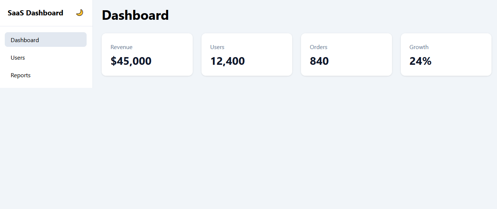
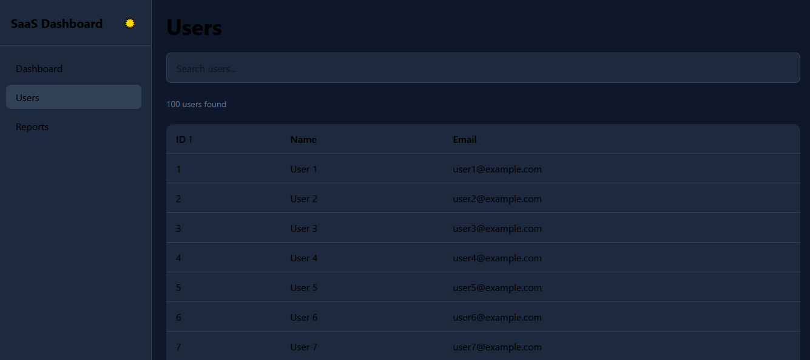
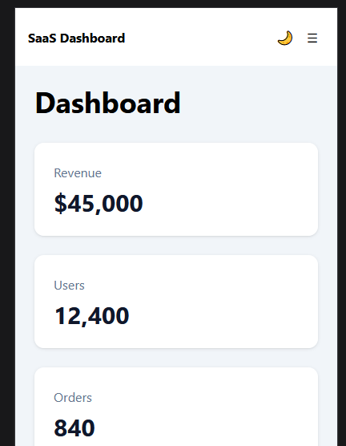

# Responsive Admin Dashboard

A responsive admin dashboard built with **Vanilla JavaScript**, **Vite**, and **Tailwind CSS v4**.

The project was created to explore modern frontend development patterns without relying on frameworks such as React, Vue, or Angular. It demonstrates how to build reusable UI components, manage application state, implement client-side routing, and create responsive user interfaces using Tailwind CSS.

## Live Demo

Add deployment URL here:

```text
https://your-demo-url.com
```

## Screenshots

### Dashboard (Light Theme)



### Dashboard (Dark Theme)



### Mobile View



---

## Features

### UI & Layout

- Responsive desktop and mobile layouts
- Collapsible mobile navigation menu
- Reusable dashboard layout
- Dark and light theme support
- Theme persistence using localStorage
- Tailwind CSS v4 styling

### Navigation

- Client-side routing
- Active navigation states
- Responsive sidebar navigation

### User Management

- User data table
- Search users by:
    - ID
    - Name
    - Email
- Debounced search input
- Sortable table columns
- Pagination
- Empty state handling

### Architecture

- Reusable UI components
- Centralized application state
- Service layer for business logic
- Utility modules
- Modular project structure

---

## Technologies

- JavaScript (ES Modules)
- Tailwind CSS v4
- Vite

---

## Project Structure

```text
src/
├── components/
│   ├── Card.js
│   ├── EmptyState.js
│   ├── Input.js
│   ├── Pagination.js
│   └── Table.js
│
├── data/
│   └── users.js
│
├── layouts/
│   └── DashboardLayout.js
│
├── pages/
│   ├── DashboardPage.js
│   └── UsersPage.js
│
├── services/
│   └── userService.js
│
├── store/
│   └── uiStore.js
│
├── utils/
│   ├── debounce.js
│   └── theme.js
│
├── app.js
└── main.js
```

---

## Key Concepts Implemented

### Responsive Design

The application is designed using a mobile-first approach with Tailwind CSS responsive utilities.

Examples:

- Mobile navigation drawer
- Responsive grid layouts
- Adaptive spacing and typography

### Reusable Components

UI elements are implemented as reusable JavaScript functions:

```js
Card();
Input();
Table();
Pagination();
EmptyState();
```

### State Management

Application state is managed through a centralized store:

```js
uiStore;
```

State includes:

- Current page
- Theme
- Mobile menu state
- Search query
- Sorting options
- Pagination state

### User Data Processing

Business logic is separated from presentation using service functions:

```js
filterUsers();
sortUsers();
paginateUsers();
getTotalPages();
```

This keeps page components focused on rendering while business logic remains reusable and testable.

---

## Getting Started

### Prerequisites

- Node.js 18+
- npm

### Installation

Clone the repository:

```bash
git clone https://github.com/your-username/responsive-admin-dashboard.git
```

Navigate to the project directory:

```bash
cd responsive-admin-dashboard
```

Install dependencies:

```bash
npm install
```

Start the development server:

```bash
npm run dev
```

Open:

```text
http://localhost:5173
```

### Build for Production

```bash
npm run build
```

Preview production build:

```bash
npm run preview
```

---

## Future Improvements

Potential enhancements:

- API integration
- Authentication
- User creation/edit forms
- Data persistence
- Dashboard analytics widgets
- Unit and integration tests
- Accessibility improvements

---

## Learning Goals

This project was built to practice:

- Tailwind CSS v4
- Responsive design principles
- Vanilla JavaScript application architecture
- Reusable component design
- State management
- Search, sorting, and pagination patterns
- Frontend project organization

---

## License

MIT
